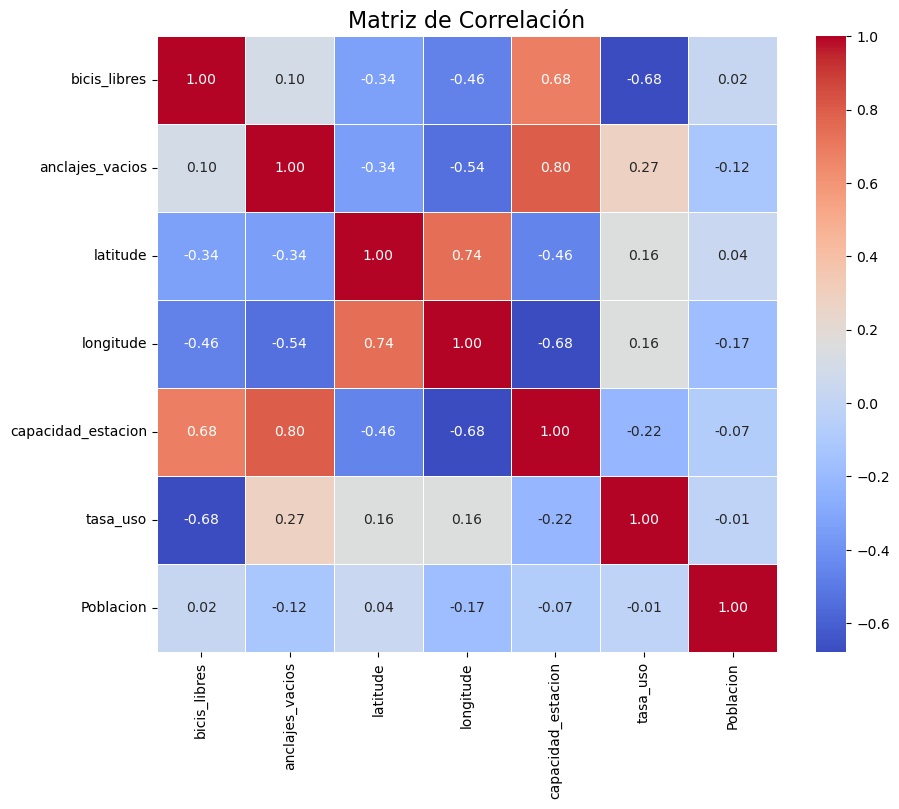
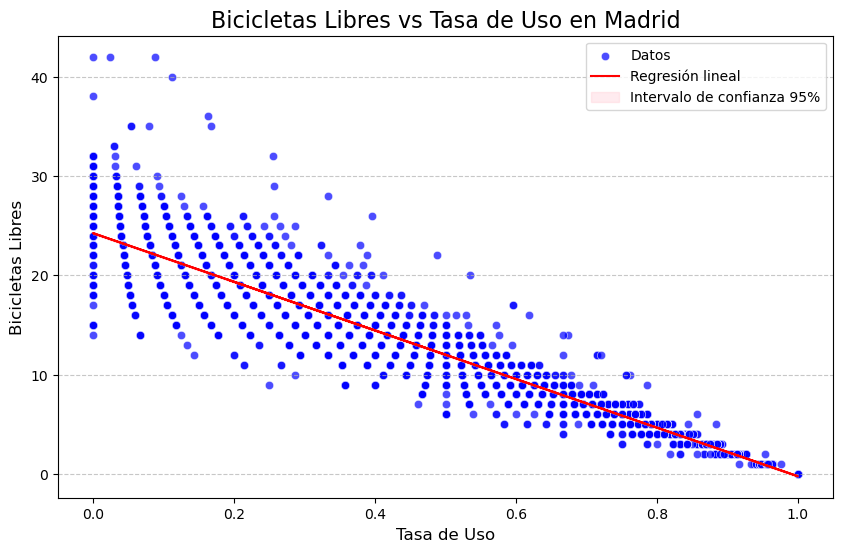
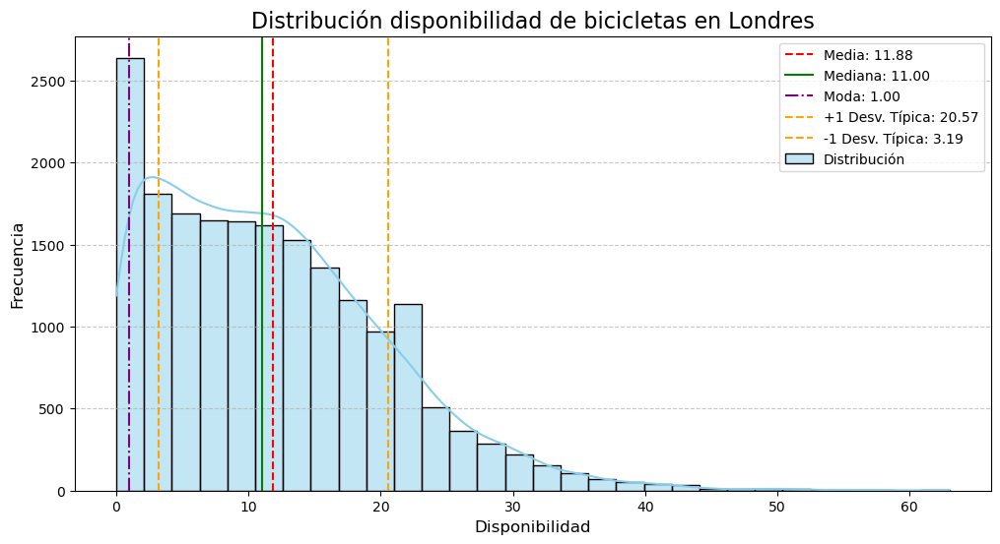
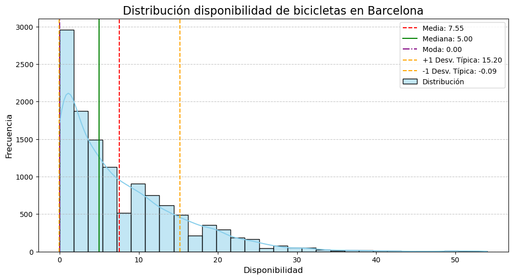
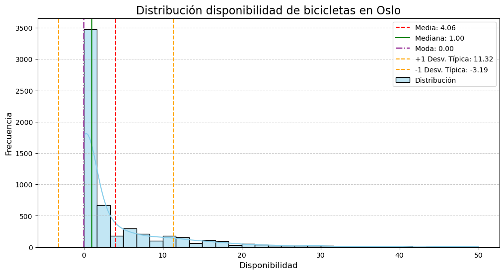
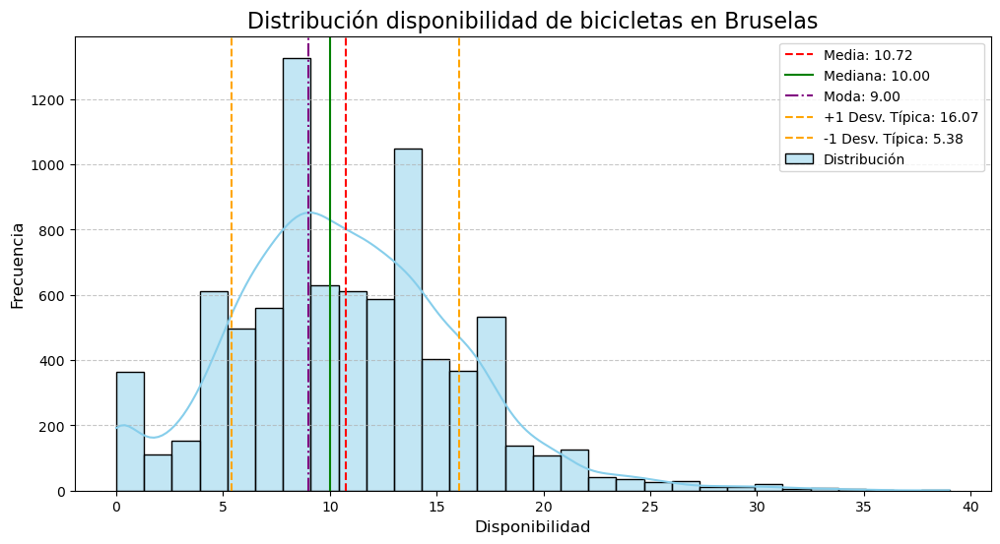

# Bicicletas públicas en ciudades europeas - Data Analysis

## Overview
Este proyecto de datos se centra en el uso de las bicicletas públicas que existen en diferentes ciudades europeas. El proyecto incluye datos relacionados con el número de bicicletas que se usan y están disponibles, el número de plazas que tiene cada estación de bicicletas, así como su localización geográfica, y el precio por utilizarlas, la población de las ciudades y el nivel de contaminación que hay durante el periodo de tiempo que dura el análisis. Su objetivo es ofrecer una comprensión de la disposición que hay en las diferentes ciudades del análisis.

## Data sources

- API Web - [CityBikes](https://api.citybik.es/v2/)
- Busqueda Web

## Workflow

1. Identificar un conjunto de datos de interés, a partir de una fuente pública.

2. Recogida de datos adicionales:

    Una vez identificado el conjunto de datos principal, el proyecto pasó a la fase de mejora mediante la recopilación de datos adicionales. Para ello, se investigó y buscó información en las diferentes páginas web para extraer información.

3. Limpieza y transformación de los datos:

    Esto incluyó la eliminación de valores atípicos, la estandarización de formatos y la resolución de cualquier incoherencia en los datos.

4. EDA: 

    Análisis Exploratorio de Datos, para comprender mejor la correlación dentro del conjunto de datos.

5. Visualización:

    Generación de gráficos y diagramas que representen eficazmente los resultados del análisis exploratorio de datos. Estas visualizaciones ayudan a comunicar los resultados con claridad.

## Hipótesis

1. ¿Cuál es el nivel de correlación en cada una de las variables?

2. ¿Cómo es la distribución de disponibilidad de bicicletas en ciudades como Londres, Barcelona, Oslo y, Bruselas? Ciudades con diferencias culturales y geográficas. 

3. Basándose en una correlación alta entre la tasa de uso y el número de bicicletas disponibles, ¿cómo es el modelo de regresión lineal de la capital de España?

4. ¿Cuáles son las estaciones con mayor tasa de uso en la ciudad de París?

## Análisis

A partir de los conjuntos de datos diferentes. Creación del conjunto de datos final sobre el que trabajar.

Composición del dataset final:

- 247.905 Filas, 12 columnas.
- Información en las columnas:
    empresa, id_empresa, ciudad, pais, bicis_libres, anclajes_vacios, latitude, longitude, fecha, capacidad_estacion, tasa_uso, geometry

## Resultados

1. Correlación de variables numéricas.

    Indicador medianamente alto entre tasa de uso "tasa_uso" y bicicletas disponibles "bicis_libres"
    
Vamos a ver el modelo de regresión lineal de las variables anteriormente dichas en la ciudad de Madrid

2. ¿Es diferente la distribución de bicicletas públicas libres en las ciudades europeas, o se comporta igual?

 

Aparentemente, en Londres, ciudad más habitada de Europa, el comportamiento de las bicis disponibles a lo largo de los días de análisis es exponencial. 

¿Y las demás ciudades?

Veamos: 

    - Barcelona

    - Oslo

    - Bruselas

A we can see from the plots, It may have something to do with a mix of the visibility and the Sentiment. For example, Hermes is the most liked brand, and because of that he does'nt need the visibility to be that high. So web visibility is 60 and they only went to Paris Fashion Week. 

But Luis Vuitton as his Sentiment is not that high, they tried to compensate by going to 2 Fashion Weeks as a strategy to augment visibility and thus the sentiment. (CAMBIAR...............)

3. Has it always been like this?

As we can see in the plot in the previous years the ranks were quite different. For starters, Hermes was thelower one from the top 5. We can also see the start of the decadency of Dior, from that graphic we could predict the position in the rank he's in 2023.

## Conclusiones

As we see in the data, evolution stops for no one. While there are some brands that kept track of innovation and thus uppered their rank, there are other brands for example Dior, that decided to stay with the classics, and even though their decacy it's not super noticable it still follows a descending pattern. 

An that is mostly because of the focuse each brand gives to visibility, user popularity, and introducing and adapting the brand strategies with the new technologies.

We also can prove that Runways nowadays are ysed as a lifestyle event and are not a necessity to gain visibility or popularity. As if they were, the lower ranked brands would be participating in the maximum number possible of shows. And our data shows otherwise.